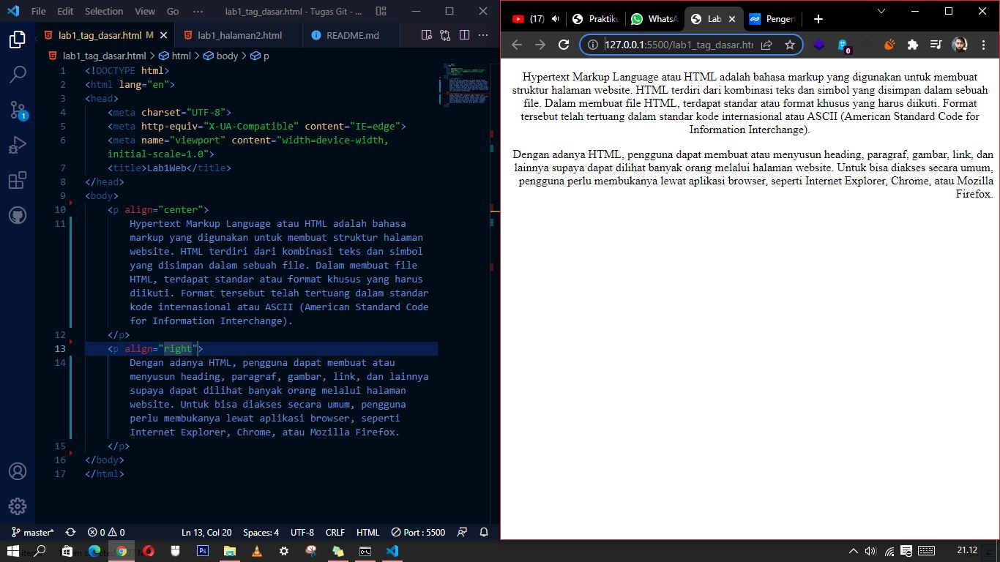
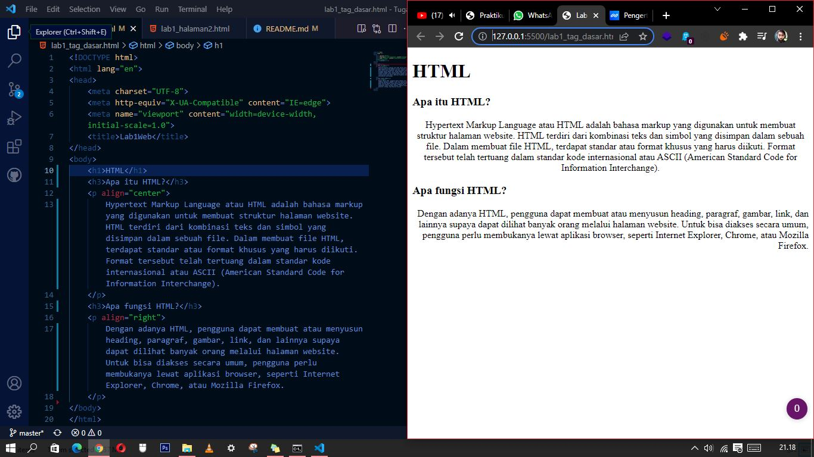
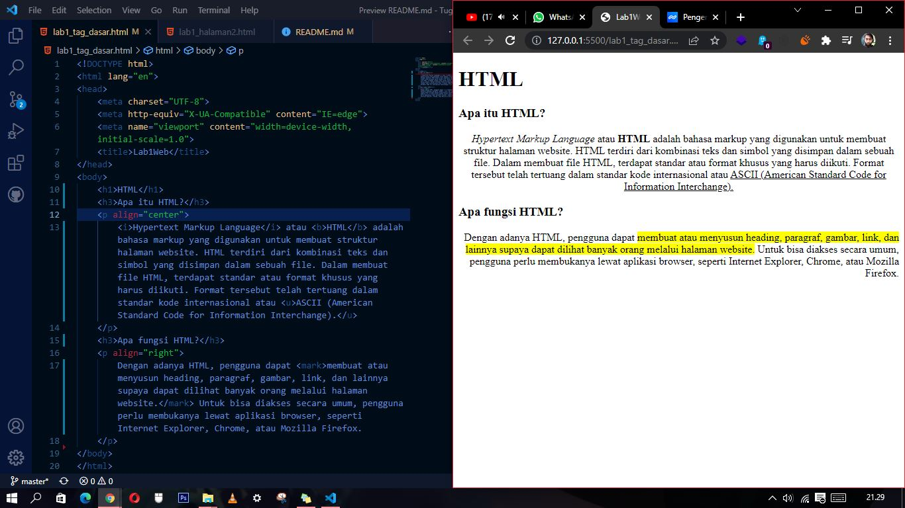
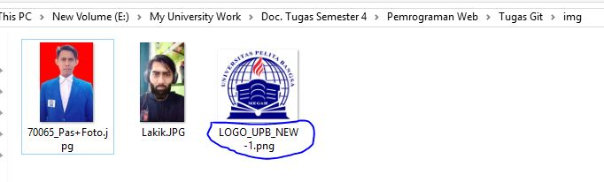
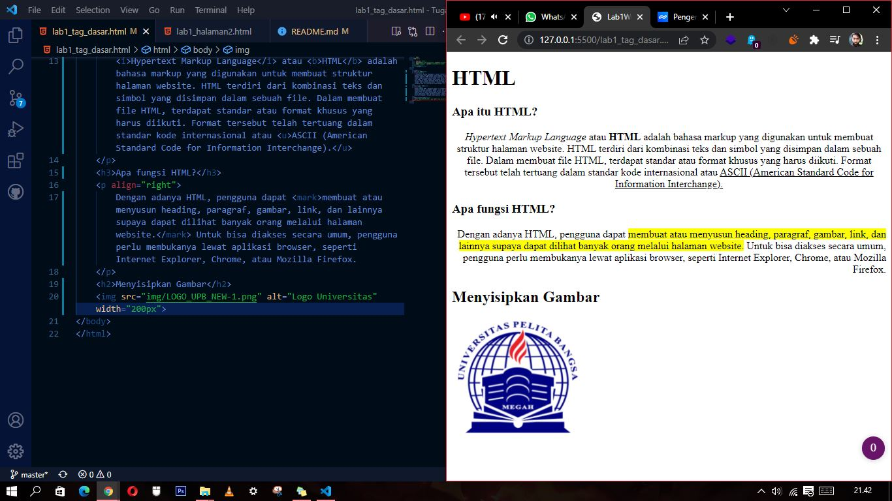
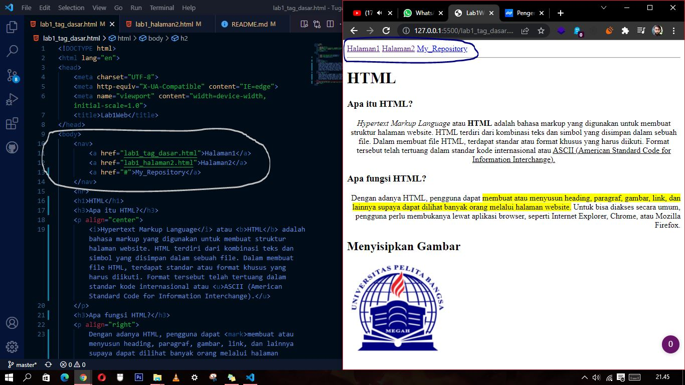

### 1. Membuat paragraf

```html
<!-- ini paragraf pertama -->
<p align="center">
    Hypertext Markup Language atau HTML adalah bahasa markup yang digunakan untuk membuat struktur halaman website. HTML terdiri dari kombinasi teks dan simbol yang disimpan dalam sebuah file. Dalam membuat file HTML, terdapat standar atau format khusus yang harus diikuti. Format tersebut telah tertuang dalam standar kode internasional atau ASCII (American Standard Code for Information Interchange). 
</p>

<!-- ini paragraf kedua -->
<p align="right">
    Dengan adanya HTML, pengguna dapat membuat atau menyusun heading, paragraf, gambar, link, dan lainnya supaya dapat dilihat banyak orang melalui halaman website. Untuk bisa diakses secara umum, pengguna perlu membukanya lewat aplikasi browser, seperti Internet Explorer, Chrome, atau Mozilla Firefox. 
</p>
```

#

### 2. Membuat judul paragraf
```html
<!-- ini judul web -->
<h1>HTML</h1>

<!-- ini judul paragraf pertama -->
<h3>Apa itu HTML?</h3>

<!-- ini judul paragraf kedua -->
<h3>Apa fungsi HTML?</h3>
```

### 3. Memformat teks
```html
<!-- macam-macam tag untuk memformat teks, contohnya seperti tag "<i>" untuk memiringkan huruf, "<u>" membuat garis bawah, "<mark>" membuat garis warna dan "<b>" untuk menebalkan huruf. -->

<!-- CONTOH..!! -->
<p align="center">
    <i>Hypertext Markup Language</i> atau <b>HTML</b> adalah bahasa markup yang digunakan untuk membuat struktur halaman website. HTML terdiri dari kombinasi teks dan simbol yang disimpan dalam sebuah file. Dalam membuat file HTML, terdapat standar atau format khusus yang harus diikuti. Format tersebut telah tertuang dalam standar kode internasional atau <u>ASCII (American Standard Code for Information Interchange).</u> 
</p>

<h3>Apa fungsi HTML?</h3>

<p align="right">
    Dengan adanya HTML, pengguna dapat <mark>membuat atau menyusun heading, paragraf, gambar, link, dan lainnya supaya dapat dilihat banyak orang melalui halaman website.</mark> Untuk bisa diakses secara umum, pengguna perlu membukanya lewat aplikasi browser, seperti Internet Explorer, Chrome, atau Mozilla Firefox. 
</p>
```

#

### 4. Menyisipkan gambar

```html
<!-- menyisipkan gambar pada web, harus sesuai dengan nama format pada folder -->
    
```

#

### 5. Menambahkan hyperlink
```html
<!-- menambahkan hyperlink navigasi -->
<nav>
    <a href="lab1_tag_dasar.html">Halaman1</a>
    <a href="lab1_halaman2.html">Halaman2</a>
    <a href="#">My_Repository</a>
</nav>
```
